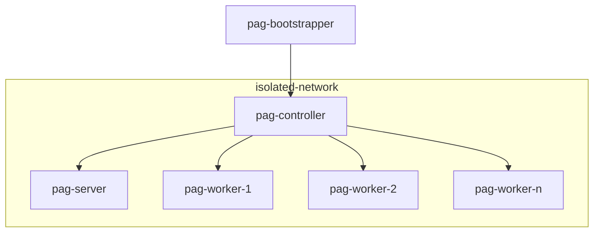

# pixi-prefect

This repository contains a recipe for installing prefect in an airgapped cluster using a combination of ansible 
and pixi.

This is meant to be used in a cluster of nodes with the following configuration:



As shown in the diagram, the majority of the cluster operates on an isolated network - this network is not connected
to the Internet. The `pag-bootstrapper` node is able to access the Internet and is used to build the installation 
artifacts. This communication with the nodes located in the `isolated-network` network happens via SSH.

This means that deployment of the prefect cluster must be done as a two-stage process:

1. `pag-bootstrapper` node gathers all packages and their dependencies by fetching them from the Internet
2. `pag-controller` is used to install stuff on itself and on the other nodes - this process is coordinated using
   ansible

There are three types of deployment that need to be considered:

1. deployment of the prefect server node;
2. Joining new worker nodes to the cluster;
3. Deployment of prefect flows;

> [!note]
> This is known to work on `ubuntu:24.04` cloud variant.
> 
> 


## Preparing installation artifacts

On a freshly installed `ubuntu:24.04` machine (_i.e._ the `pag-bootstrapper`), run the `build-bundle.py` script. This
will fetch the necessary packages and produce a tar file with everything needed to install the cluster.

> [!IMPORTANT]
> Be sure to not upgrade the bootstrapper machine, it should be kept in a similar state as the cluster nodes.

```python
python3 build-bundle.py
```


## Preparing the ansible controller node

Copy the installation artifact produced by the `build-bundle.py` script onto the `pag-controller` node. Untar 
it and run the included installation script:

```shell
tar -xvf pag-software-bundle.tar-gz
cd pag-software-bundle
bash install-pag-controller.sh
```

This will install ansible on the `pag-controller` node.

Now make a copy of the provided ansible inventory and secrets files and adjust according to your cluster:

```shell
cd ansible
cp inventory.yml.example inventory.yml
cp secrets.yml.example secrets.yml
```

After having configured the ansible inventory, and in order to have ansible correctly connect via SSH to all nodes 
in the inventory, we advise you to run a preparation command of:

> ```shell
> ANSIBLE_HOST_KEY_CHECKING=false ansible all -i inventory.yml -m ping
> ```

More info here: https://github.com/ansible/ansible/issues/63870


## Deployment of the prefect server node

In order to deploy the prefect server you just need to execute the appropriate ansible playbook:

```shell
ansible-playbook -i inventory.yml main.yml --tags prefect-server 
```

After a successful deployment the node shall be running the prefect server instance on port 4200.

The server will have been instantiated with two work pools of type `process`. These are named:

- `cpu-pool` This pool is meant to be used for flows that do not access any GPUs.
- `gpu-pool`. This pool is meant to be used for flows that access GPUs.


> [!TIP]
> After the deployment is complete, you can access the prefect server UI by tunneling port 4200 to 
> your local machine:
> 
> ```shell
> ssh -L 4200:localhost:4200 -N <pag-controller-host>
> ```
> 
> Now you can access the prefect server UI by visiting `http://localhost:4200` with your browser.
> For authentication, the credentials are the same you provided in the `secrets.yml` file
> 


## Deployment of the prefect worker nodes

Deployment of worker nodes is similar, just run the ansible playbook:

```shell
cd ansible
ansible-playbook -i inventory.yml main.yml --tags prefect-worker 
```

After a successful deployment the worker node can be running up to two prefect worker instances, one 
for each work pool that is configured in the node's section of the ansible inventory. 
These are configured by the following systemd unit files:

- `/etc/systemd/system/prefect-worker-cpu.service`
- `/etc/systemd/system/prefect-worker-gpu.service`


### Joining new prefect worker nodes to the cluster

The number of prefect worker nodes can be managed dynamically. Each time a new node is added, the prefect base 
environment must be installed and configured. Additionally, the environments of existing flows must also be installed
in the worker node. In practice this means:

1. Update the ansible inventory file
2. Run the ansible playbook again, like this:

```shell
cd ansible
ansible-playbook -i inventory.yml main.yml --tags prefect-worker --limit <ip-of-new-worker-node>
```


## Deploying prefect flows

Each prefect flow runs on its own isolated environment. This means that each flow's environment must be deployed
on the worker nodes where the flow can be executed. It also means that the actual flow must be deployed by means of 
creating a prefect deployment that uses local storage. These steps are performed by the `prefect-flow-deployment.yml`
ansible playbook.

The playbook accepts the following arguments:

- `flow_dir` (mandatory) - the directory containing the flow to be deployed, along with its `pixi.toml` and 
  `pixi.lock` files
- `entrypoint` (mandatory) - the entrypoint of the flow. This is the name of the python callable that is decorated with 
  `@flow` in the flow's python module. It must be specified as `<python_module>:<flow_name>`, for example 
  `main.py:my_workflow`
- `work_pool` (optional) - the name of the work pool that the flow will use. If not specified, it defaults to
  `cpu-pool` - **NOTE**: flows that require GPU access must use the `gpu-pool` work pool instead.
- `deployment_name` (optional) - the name of the prefect deployment to be created. If not specified, it defaults to 
  the name of the flow function

In order to deploy a new prefect flow into the airgapped cluster you need to

1. Prepare a directory with the flow and a suitable packed pixi env. Check the _Creating a new flow_ section below 
   for an example of how to create a new flow;

2. Copy the flow directory to the `pag-controller` node;

2. Run the `prefect-flow-deployment.yml` ansible playbook, passing it suitable arguments:

   1. Passing only the `flow_dir` and `flow_entrypoint` arguments, which are mandatory:
   
      ```shell
      ansible-playbook -i inventory.yml prefect-flow-deployment.yml \
          -e "flow_dir=/pixi-prefect/flows/demo2" -e "flow_entrypoint=main.py:my_workflow"
      ```
      
      This will run on the `cpu-pool`, meaning that the flow will not be able to access GPUs, and the deployment
      will be named `my_workflow`, which is the name of the flow function.
      
   2. Running on the `gpu-pool` work pool, in order to be able to acquire GPUs:

      ```shell
      ansible-playbook -i inventory.yml prefect-flow-deployment.yml \
          -e "flow_dir=/pixi-prefect/flows/demo3"  \
          -e "flow_entrypoint=main.py:single_acquisition_prediction_flow" \
          -e "work_pool=gpu-pool"
      ```
   

### Creating a new flow
 
New flows must use pixi to manage their environments. This can be done by running the following command:

```shell
pixi init myflow
```

This creates a new directory called `myflow` with a `pixi.toml` file inside. This file contains the configuration
for the pixi environment. Change into the new directory.

Use Python version 3.12, as that is the version in use in the cluster nodes, which are based on ubuntu24:04
Python the latest minor version of Python 3.9:

```shell
pixi add python=3.12
```

Be sure to also add prefect as a dependency, specifically the same version minor version as the one used in the cluster.
you can check the version specification used in the `pixi.toml` file located in the root of this repository. 
For example:

```shell
pixi add "prefect>=3.4.10,<4"
```

Now author your flow in a new python file and install any required dependencies. For example:

Adding the cowpy dependency:

```shell
pixi add cowpy
```

And writing a simple prefect flow:

```python
# contents of myflow/main.py
import sys

from cowpy import cow
from prefect import flow


@flow(log_prints=True)
def my_workflow(name: str = "world") -> str:
    my_cow = cow.get_cow()()
    message = F"Hello, {name.capitalize()}!"
    formatted_message = my_cow.milk(message)
    print(f"running from environment at {sys.executable}")
    print(formatted_message)
    return message


if __name__ == "__main__":
    my_workflow.serve(name="my_local_deployment")
```

You can now test this flow locally by starting a prefect server, deploying the flow and running it:

> [!note]
> You must use pixi to run all commands
> 

Start by initializing a local prefect server:

```shell
pixi run prefect server start
```

This launches a local prefect server which you can access by visiting `http://localhost:4200`.

On a different terminal, deploy the flow:

```shell
pixi run python myflow.py
```

This registers the flow with the prefect server and starts a worker that can execute it. 
You can now schedule a run of the flow by either using the prefect server UI via your web browser, 
or opening another terminal and using this command:

```shell
pixi run prefect deployment run 'my_workflow/my_local_deployment'
```

You can monitor the execution of the flow either on the prefect UI or on the terminal that is running the deployment.

Once the flow works OK and we are ready to have it sent to the airgapped prefect cluster we can now use pixi to pack the
flow dependencies into a tar file and send it together with the flow code to the `pag-controller` node.

```shell
mkdir to-deploy
cd to-deploy
cp ../myflow.py .
pixi exec pixi-pack ../pixi.toml --output-file packed-env.tar

# copy the flow dir to pag-controller, for further deployment in the cluster
cd ..
scp -r to-deploy <pag-controller-host>
```

> [!TIP]
> If you name the output file `packed-env.tar` the ansible playbook that is used to deploy flows in the cluster will
> recognize it automatically.


## Extra notes

### Checking that an ansible playbook will produce the intended result

You may use the `--check` argument to ansible-playbook in order to have it perform a dry-run of the playbook. 
For example:

```shell
ansible-playbook -i inventory.yml prefect-flow-deployment.yml \
-e "flow_dir=/pixi-prefect/flows/demo1" \
-e "flow_entrypoint=main.py:my_workflow" \
--check
```

It will produce an output with the changes that would be applied, without actually applying them.


### Running a prefect-related command manually on a worker node

In order to run a prefect-related command manually on a worker node, you must:

- ssh to the node
- switch to the `prefect` user
- set the `PREFECT_API_URL` environment variable - you can check the correct value in the prefect workers systemd unit 
  files at `/etc/systemd/system/prefect-worker-{cpu,gpu}.service`
- set also the `PREFECT_API_AUTH_STRING` environment variable - you can check the correct value in the secrets file
- Either activate the prefect pixi env
- Use prefect CLI as usual

```shell
# after having -> ssh <worker-node>
sudo su prefect
cd
export PREFECT_API_URL=http://10.0.100.164:4201/api 
export PREFECT_API_AUTH_STRING="admin:my_password"

# activate the pixi env
source pixi-env/activate.sh
prefect flow ls
```


[pipx]: https://pipx.pypa.io/stable/
[pixi]: https://pixi.sh/latest/
