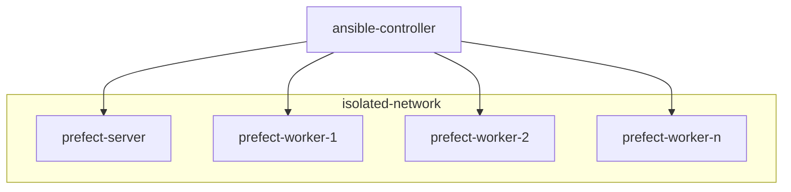

# pixi-prefect

This repository contains a recipe for installing prefect in an airgapped cluster using a combination of ansible 
and pixi.

This is meant to be used in a cluster of nodes with the following configuration:



As shown in the diagram, the majority of the cluster operates on an isolated network - this network is not connected
to the Internet. The `ansible-controller` node is able to both access the Internet and communicate with the 
isolated nodes. This communication with the nodes located in the `isolated-network` network happens via SSH.

This means that deployment of the prefect cluster must be done as a two-stage process:

1. `ansible-controller` node gathers all packages and their dependencies by fetching them from the Internet
2. packages get copied over to the relevant nodes where they are then installed - this process is coordinated using
   ansible

There are three types of deployment that need to be considered:

1. deployment of the prefect server node;
2. Joining new worker nodes to the cluster;
3. Deployment of prefect flows;


## Preparing the ansible controller node

> [!note]
> This is known to work on `ubuntu:24.04` cloud variant.

Start by installing [pipx], which will be used to install ansible - get it from the default ubuntu repos

```shell
sudo apt update && \
sudo apt install --yes pipx
pipx ensurepath
```

Now install ansible via pipx:

```shell
pipx install --include-deps ansible
```

Now you will need to install [pixi]. Use the provided `install-pixi.sh` script, which was downloaded from 
the pixi website

```shell
bash install-pixi.sh
```

Logout and log back in in order for the installation to be complete

Finally, install `pixi-pack` and `pixi-unpack` with:

```shell
pixi global install pixi-pack pixi-unpack
```


## Deployment of the prefect server node

In order to deploy the prefect server you will need to:

1. Download all the system dependencies for the PostgreSQL database and the Caddy web server, which are being
   used in the prefect server setup

   This can be done by either:

   - Getting the files from object storage
   - Running the `download-packages.sh` script, which would download them from the ubuntu repositories

   > [!WARNING]
   > In either case, the downloaded .deb files mus be placed at `/tmp/offline-packages/{postgresql,caddy}`

2. Create a pixi packed environment with prefect and its additional dependencies

   This can be done by either:

    - Getting the files from object storage
    - Running the `download-packages.sh` script, which would download them from the ubuntu repositories

      ```shell
      pixi pack --output-file /tmp/prefect-base.tar
      ```

   > [!WARNING]
   > In either case, the downloaded .deb files mus be placed at `/tmp/prefect-base.tar`

- The ansible secrets file, located at `ansible/secrets.yml`. Create this file, taking the 
  existing `secrets.yml.example` file as a reference
- The ansible inventory file, located at `ansible/inventory.yml`. Create this file, taking the 
  existing `inventory.yml.example` file as a reference and add the addresses of the respective prefect server and worker 
  nodes.

> [!WARNING]
> In order to have ansible correctly connect via SSH to all nodes in the inventory we advise you to run a
> preparation command of:
>
> ```shell
> ANSIBLE_HOST_KEY_CHECKING=false ansible all -i inventory.yml -m ping
> ```
> 
> More info here: https://github.com/ansible/ansible/issues/63870

Proceed to deploy the prefect server node with the following command:

```shell
cd ansible
ansible-playbook -i inventory.yml main.yml --tags database --tags webserver --tags prefect --tags server
```


### Contacting the prefect server

The architecture described at the top of the files speficies that the prefect server will be running on an isolated
network. However, if you have suitable credentials in order to login to the `ansible-controller` and the 
`prefect-server` nodes, you can setup an SSH tunnel like this:

```shell
ssh -L 4200:localhost:4200 -L 4201:localhost:4201 -N prefect-server
```

> [!note]
> The above command assumes that `prefect-server` is suitably configured for SSH in your `~/.ssh/config` file
> 

This will allow you to both:

- Access the prefect server UI using your browser by visiting `http://localhost:4200`
- Access the prefect server API by making requests to `http://localhost:4200/api/`


## Joining new prefect worker nodes to the cluster

The number of prefect worker nodes can be managed dynamically. Each time a new node is added, the prefect base 
environment must be installed and configured. Additionally, the environments of existing flows must also be installed
in the worker node.


## Deploying prefect flows

Each prefect flow shall run on its own isolated environment. This means that each flow's environment must be deployed
on the worker nodes where the flow can be executed.


[pipx]: https://pipx.pypa.io/stable/
[pixi]: https://pixi.sh/latest/
