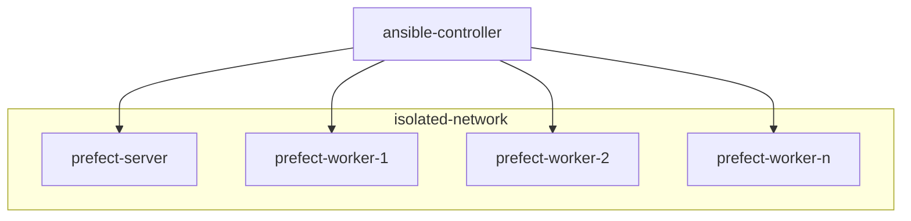

# pixi-prefect

This repository contains a recipe for installing prefect in an airgapped cluster using a combination of ansible 
and pixi.

This is meant to be used in a cluster of nodes with the following configuration:



As shown in the diagram, the majority of the cluster operates on an isolated network - this network is not connected
to the Internet. The `ansible-controller` node is able to both access the Internet and communicate with the 
isolated nodes. This communication with the nodes located in the `isolated-network` network happens via SSH.

This means that deployment of the prefect cluster must be done as a two-stage process:

1. `ansible-controller` node gathers all packages and their dependencies by fetching them from the Internet
2. packages get copied over to the relevant nodes where they are then installed - this process is coordinated using
   ansible

There are three types of deployment that need to be considered:

1. deployment of the prefect server node;
2. Joining new worker nodes to the cluster;
3. Deployment of prefect flows;


## Preparing the ansible controller node

> [!note]
> This is known to work on `ubuntu:24.04` cloud variant.

Start by installing rsync and [pipx], which will be used to install ansible - get it from the default ubuntu repos

```shell
sudo apt update && \
sudo apt install --yes pipx rsync
pipx ensurepath
```

Now install ansible via pipx:

```shell
pipx install --include-deps ansible
```

Now you will need to install [pixi]. Use the provided `install-pixi.sh` script, which was downloaded from 
the pixi website

```shell
bash install-pixi.sh
```

Logout and log back in in order for the installation to be complete

Finally, install `pixi-pack` and `pixi-unpack` with:

```shell
pixi global install pixi-pack pixi-unpack
```


## Deployment of the prefect server node

In order to deploy the prefect server you will need to:

Download all the system dependencies for the PostgreSQL database and the Caddy web server, which are being
used in the prefect server setup

This can be done by either:

- Getting the files from object storage and into the `/tmp/offline-packages` directory`
- Running the `download-packages.sh` script, which would download them from the ubuntu repositories - this can be 
  achieved with the following command:

  ```shell
  bash download-packages.sh
  ```

> [!WARNING]
> In either case, the downloaded .deb files must be placed at `/tmp/offline-packages/{acl,caddy,postgresql,rsync}`


Now create a pixi packed environment with prefect and its additional dependencies

This can be done by either:

- Getting the already-packed env from object storage and into the `/tmp/prefect-base.tar` file
- Using `pixi-pack` 

  ```shell
  pixi pack --output-file /tmp/prefect-base.tar
  ```

> [!WARNING]
> In either case, the downloaded .deb files must be placed at `/tmp/prefect-base.tar`


Create also:

- The ansible secrets file, located at `ansible/secrets.yml`. Create this file, taking the 
  existing `secrets.yml.example` file as a reference

- The ansible inventory file, located at `ansible/inventory.yml`. Create this file, taking the 
  existing `inventory.yml.example` file as a reference and add the addresses of the respective prefect server and worker 
  nodes.

> [!WARNING]
> In order to have ansible correctly connect via SSH to all nodes in the inventory, we advise you to run a
> preparation command of:
>
> ```shell
> ANSIBLE_HOST_KEY_CHECKING=false ansible all -i ansible/inventory.yml -m ping
> ```
> 
> More info here: https://github.com/ansible/ansible/issues/63870


Proceed to deploy the prefect server node with the following command:

```shell
cd ansible
ansible-playbook -i inventory.yml main.yml --tags prefect-server 
```

After a successful deployment the node shall be running the prefect server instance with port 4200 serving the prefect
UI and port 4201 serving the API.

The server will have been instantiated with two work pools of type `process`. These are named:

- `cpu-pool` This pool is meant to be used for flows that do not access any GPUs.
- `gpu-pool`. This pool is meant to be used for flows that access GPUs.


> [!TIP]
> After the deployment is complete, you can access the prefect server UI by tunneling both ports 4200 and 4201 to 
> your local machine:
> 
> ```shell
> ssh -L 4200:localhost:4200 -L 4201:localhost:4201 -N <ssh-host-alias>
> ```
> 
> Now you can access the prefect server UI by visiting `http://localhost:4200` with your browser.
> For authentication, username is `admin` and the password is the one you specified in the `secrets.yml` file.
> 


## Deployment of the prefect worker nodes

In order to deploy the prefect worker nodes you will need to follow some of the same steps as for the prefect server:

- prepare the same pixi environment - you can reuse the same `prefect-base.tar` file
- Use the same inventory file
- Use the same secrets file

Then run the respective ansible playbook

```shell
cd ansible
ansible-playbook -i inventory.yml main.yml --tags prefect-worker 
```

After a successful deployment the worker node can be running up to two prefect worker instances, one for each work 
pool that is configured in the node's section of the ansible inventory. 
These are configured by the following systemd unit files:

- `/etc/systemd/system/prefect-worker-cpu.service`
- `/etc/systemd/system/prefect-worker-gpu.service`


### Joining new prefect worker nodes to the cluster

The number of prefect worker nodes can be managed dynamically. Each time a new node is added, the prefect base 
environment must be installed and configured. Additionally, the environments of existing flows must also be installed
in the worker node. In practice this means:

1. Update the ansible inventory file
2. Run the ansible playbook that performs deployment of prefect workers again


## Deploying prefect flows

Each prefect flow runs on its own isolated environment. This means that each flow's environment must be deployed
on the worker nodes where the flow can be executed. It also means that the actual flow must be deployed by means of 
creating a prefect deployment that uses local storage. These steps are performed by the `prefect-flow-deployment.yml`
ansible playbook.

The playbook accepts the following arguments:

- `flow_dir` (mandatory) - the directory containing the flow to be deployed, along with its `pixi.toml` and 
  `pixi.lock` files
- `entrypoint` (mandatory) - the entrypoint of the flow. This is the name of the python callable that is decorated with 
  `@flow` in the flow's python module. It must be specified as `<python_module>:<flow_name>`, for example 
  `main.py:my_workflow`
- `work_pool` (optional) - the name of the work pool that the flow will use. If not specified, it defaults to
  `cpu-pool` - **NOTE**: flows that require GPU access must use the `gpu-pool` work pool instead.
- `deployment_name` (optional) - the name of the prefect deployment to be created. If not specified, it defaults to 
  the name of the flow function

In order to deploy a new prefect flow into the airgapped cluster you need to

1. Prepare a directory with the flow and suitable `pixi.toml` and `pixi.lock` files

   A flow is deployable to the airgapped cluster if you prepare a directory with the following contents:

   - `<some_python_module>.py` - the file containing the flow itself
   - `pixi.toml` - the pixi configuration file, containing the necessary information to fetch the flow dependencies
   - `pixi.lock` - the lockfile for the flow dependencies
   
   Check the _Creating a new flow_ section below for an example of how to create a new flow.

2. Run the `prefect-flow-deployment.yml` ansible playbook, passing it suitable arguments:

   1. Passing only the `flow_dir` and `flow_entrypoint` arguments, which are mandatory:
   
      ```shell
      ansible-playbook -i inventory.yml prefect-flow-deployment.yml \
          -e "flow_dir=/pixi-prefect/flows/demo2" -e "flow_entrypoint=main.py:my_workflow"
      ```
      
      This will run on the `cpu-pool`, meaning that the flow will not be able to access GPUs, and the deployment
      will be named `my_workflow`, which is the name of the flow function.
      
   2. Running on the `gpu-pool` work pool, in order to be able to acquire GPUs:

      ```shell
      ansible-playbook -i inventory.yml prefect-flow-deployment.yml \
          -e "flow_dir=/pixi-prefect/flows/demo3"  \
          -e "flow_entrypoint=main.py:single_acquisition_prediction_flow" \
          -e "work_pool=gpu-pool"
      ```
   

### Creating a new flow
 
New flows must use pixi to manage their environments. This can be done by running the following command:

```shell
pixi init myflow
```

This creates a new directory called `myflow` with a `pixi.toml` file inside. This file contains the configuration
for the pixi environment. Change into the new directory.

Specify the python version that the flow will use in order to have pixi prepare it - for example in order to use 
Python the latest minor version of Python 3.9:

```shell
pixi add python=3.9
```

Be sure to also add prefect as a dependency, specifically the same version minor version as the one used in the cluster.
you can check the version specification used in the `pixi.toml` file located in the root of this repository. 
For example:

```shell
pixi add "prefect>=3.4.10,<4"
```

Now author your flow in a new python file and install any required dependencies. For example:

Adding the cowpy dependency:

```shell
pixi add cowpy
```

And writing a simple prefect flow:

```python
# contents of myflow/main.py
import sys

from cowpy import cow
from prefect import flow


@flow(log_prints=True)
def my_workflow(name: str = "world") -> str:
    my_cow = cow.get_cow()()
    message = F"Hello, {name.capitalize()}!"
    formatted_message = my_cow.milk(message)
    print(f"running from environment at {sys.executable}")
    print(formatted_message)
    return message


if __name__ == "__main__":
    my_workflow.serve(name="my_local_deployment")
```

You can now test this flow locally by starting a prefect server, deploying the flow and running it:

> [!note]
> You must use pixi to run all commands
> 

Start by initializing a local prefect server:

```shell
pixi run prefect server start
```

This launches a local prefect server which you can access by visiting `http://localhost:4200`.

On a different terminal, deploy the flow:

```shell
pixi run python myflow.py
```

This registers the flow with the prefect server and starts a worker that can execute it. 
You can now schedule a run of the flow by either using the prefect server UI via your web browser, 
or opening another terminal and using this command:

```shell
pixi run prefect deployment run 'my_workflow/my_local_deployment'
```

You can monitor the execution of the flow either on the prefect UI or on the terminal that is running the deployment.

Once the flow works OK and we are ready to have it sent to the airgapped prefect cluster we can now optionally, 
stop both the local prefect server and the flow deployment we used for testing - just press `ctrl+C` on both 
terminal windows.


## Extra notes

### Checking that an ansible playbook will produce the intended result

You may use the `--check` argument to ansible-playbook in order to have it perform a dry-run of the playbook. 
For example:

```shell
ansible-playbook -i inventory.yml prefect-flow-deployment.yml \
-e "flow_dir=/pixi-prefect/flows/demo1" \
-e "flow_entrypoint=main.py:my_workflow" \
--check
```

It will produce an output with the changes that would be applied, without actually applying them.


### Running a prefect-related command manually on a worker node

In order to run a prefect-related command manually on a worker node, you must:

- ssh to the node
- switch to the `prefect` user
- call prefect using its full path

```shell
# after having -> ssh <worker-node>
sudo su prefect
cd
/opt/prefect/pixi-env/env/bin/prefect --help
```


[pipx]: https://pipx.pypa.io/stable/
[pixi]: https://pixi.sh/latest/
